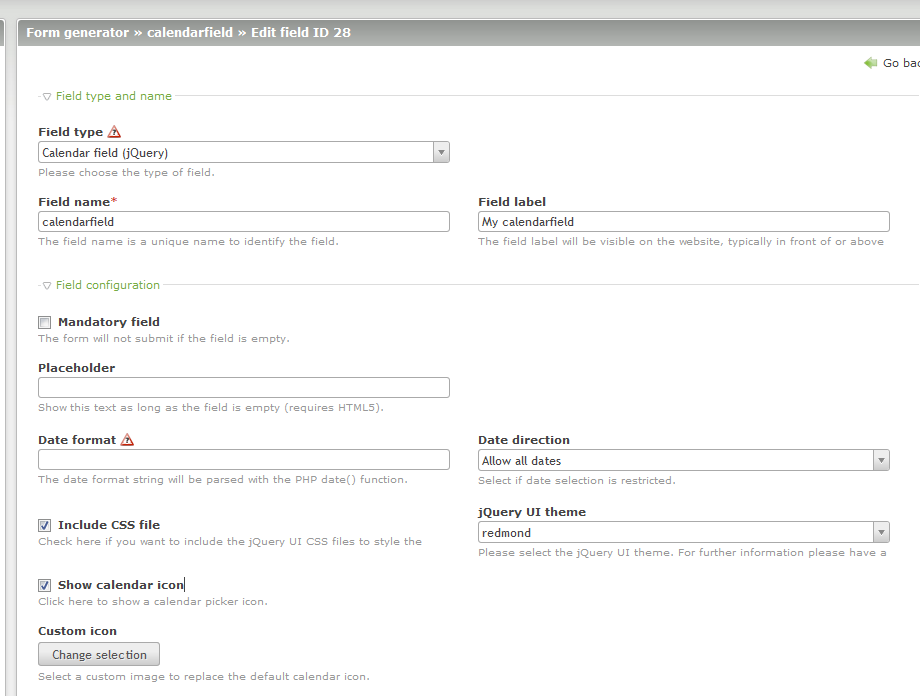
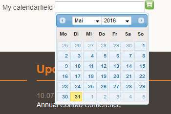

# Contao Extension: hofff.com - jQuery calendar field

Frontend text field with datepicker for Contao Open Source CMS (uses jQuery).

## Features

- Uses jQuery (replaces Mootools version)
- define date format and which dates are allowed (e.g. only date in the future)
- optional usage of jQuery UI
- optional selection of custom icon
- optional definition of dates/weekdays, that should be disabled/not allowed

## Compatibility

- min. Contao version: >= 3.3.0
- max. Contao version: <  3.6.0

## Installation

Install the extension via composer: [hofff/contao-calendarfield](https://packagist.org/packages/hofff/contao-calendarfield).

If you prefer to install it manually, download the latest release here: https://github.com/hofff/contao-calendarfield/releases

## Dependency

This extension is dependent on the following extensions:

- [[menatwork/contao-multicolumnwizard]](https://packagist.org/packages/menatwork/contao-multicolumnwizard)

## Screenshots

