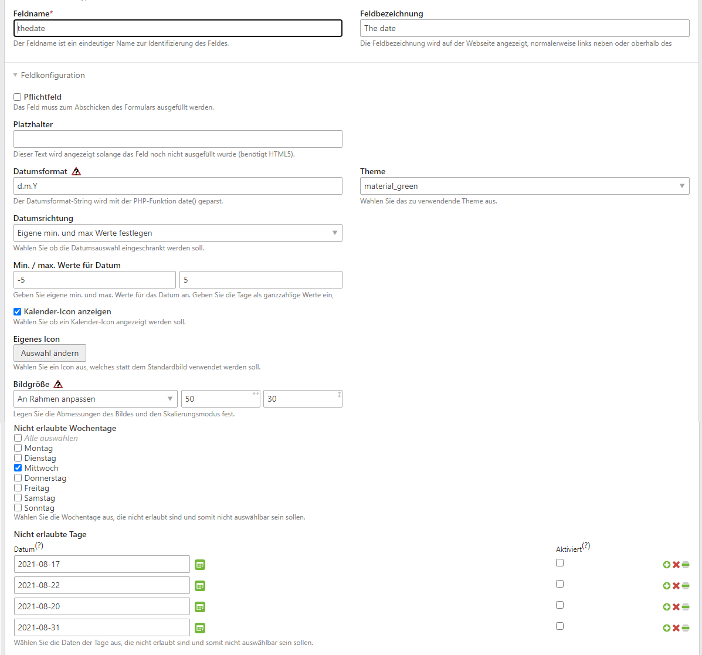

# Contao Extension: hofff.com - calendar field

Frontend text field with datepicker for Contao Open Source CMS.

## Features

- Uses flatpickr (https://flatpickr.js.org/) which ist dependency free
- define date format and which dates are allowed (e.g. only date in the future)
- optional usage of themes
- optional selection of custom icon
- optional definition of dates/weekdays, that should be disabled/not allowed

## Compatibility

- Contao version >= 4.9.0

## Installation

Install the extension via Contao Manager: [hofff/contao-calendarfield](https://packagist.org/packages/hofff/contao-calendarfield).

## Dependency

This extension is dependent on the following extensions:

- [[menatwork/contao-multicolumnwizard]](https://packagist.org/packages/menatwork/contao-multicolumnwizard)

## Screenshots

